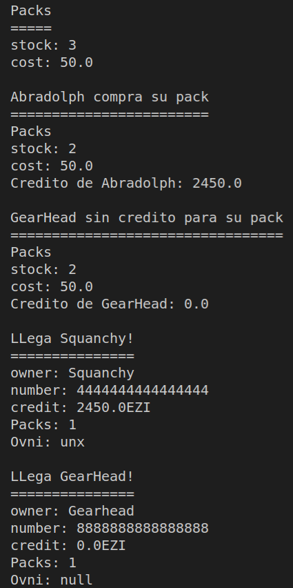

# Ricksy-Java

Este es un examen creado por [dfleta](https://github.com/dfleta).

Todo lo hecho en este código ha sido a partir del enunciado propuesto en el [repositorio original.](https://github.com/dfleta/ricksy-business-observer).

Se proporcionan unas historias de usuario, un diagrama UML y el archivo main `App.java`. 

El propósito de este kata es obtener experiencia con:
- TDD
- DDD
- Interpretación de diagramas UML
- Principios SOLID
- POO

Además de lo mencionado anteriormente, utilizo este kata para practicar streams.

## Historias de usuario

Las historias de usuario proporcionadas son las siguientes:

## Diagrama UML

El diagrama UML proporcionado por [dfleta](https://github.com/dfleta):

